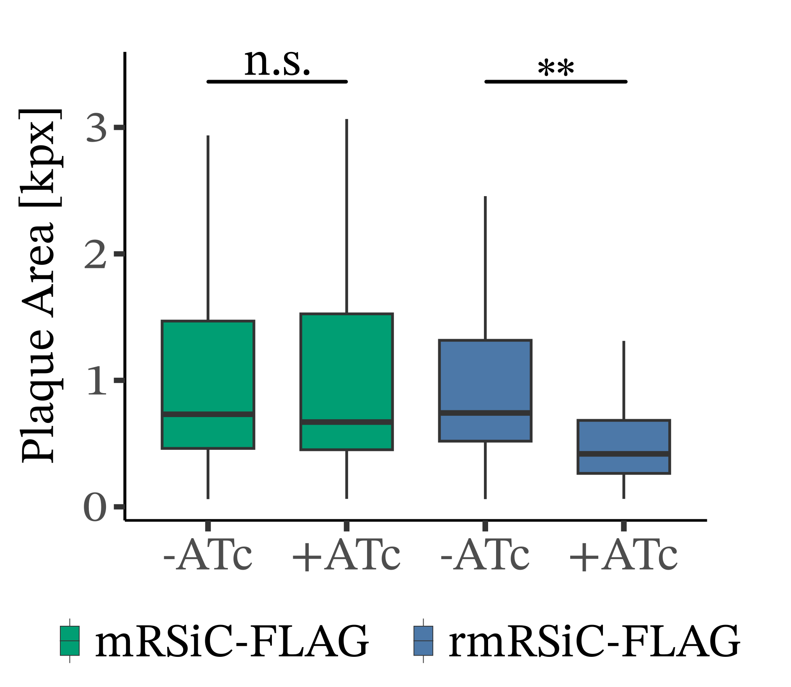
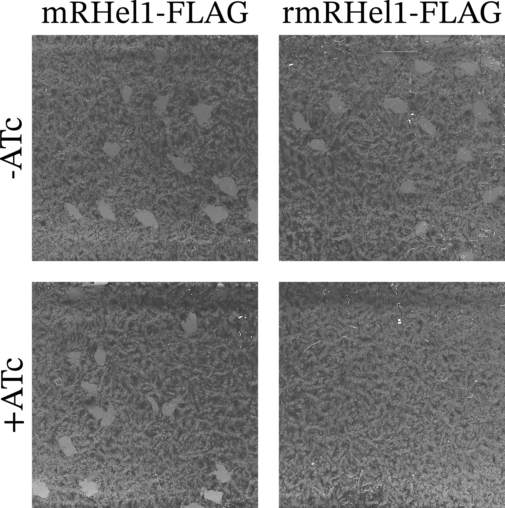
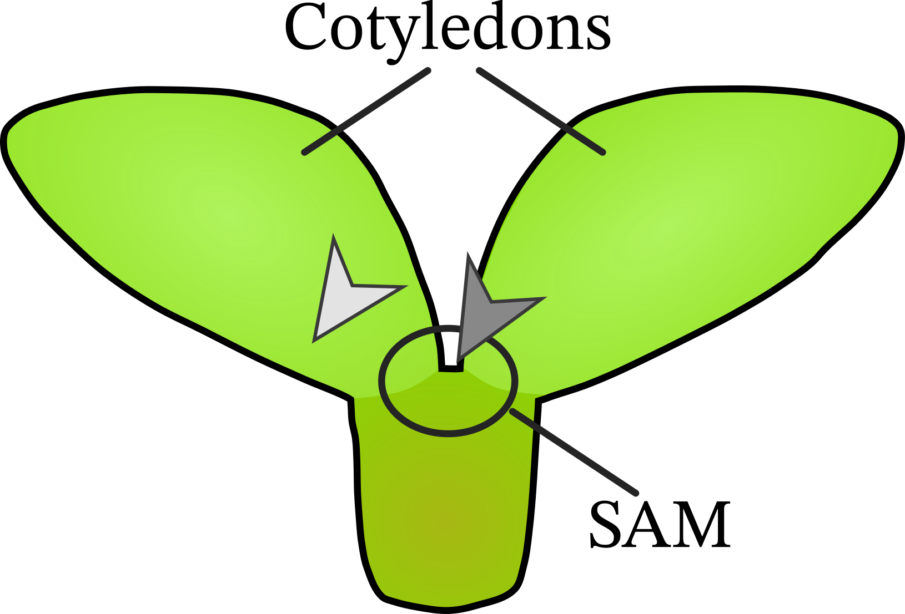
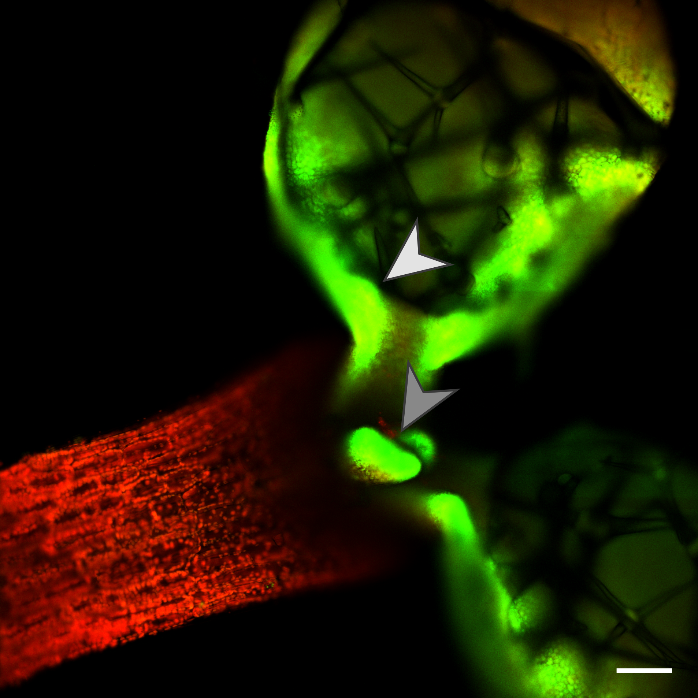
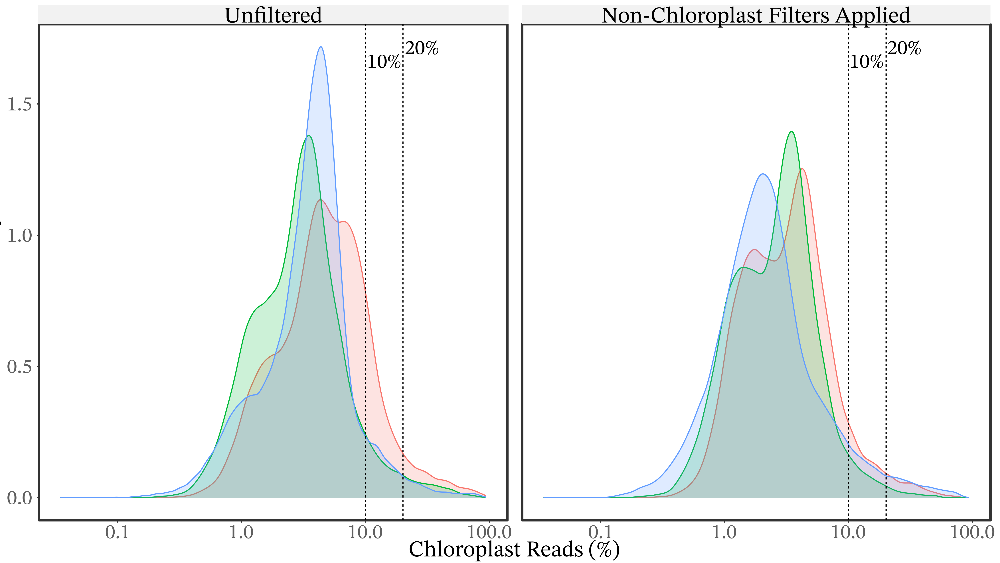
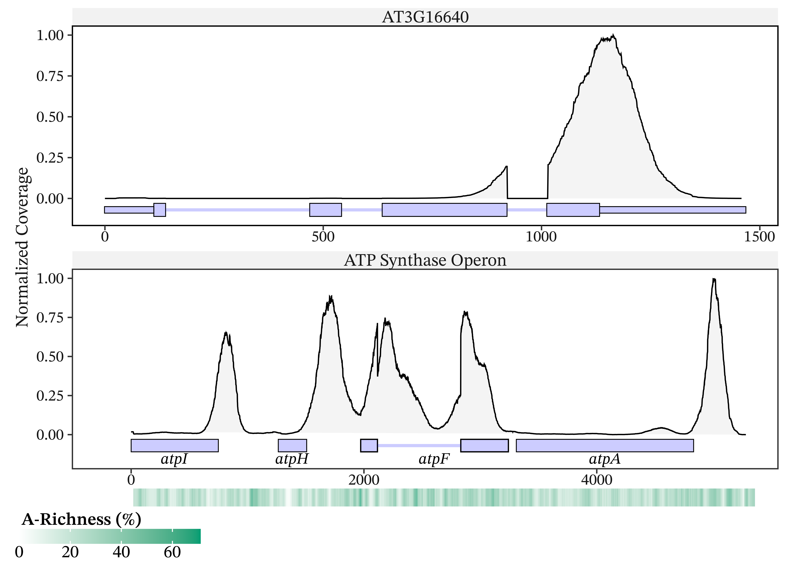
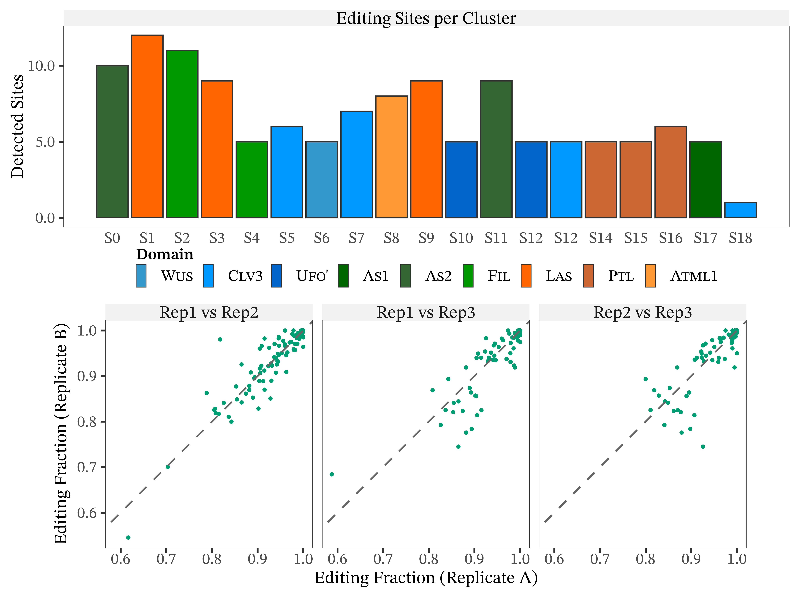

## Welcome
Happy to be here  
Enjoy your Drink, this is supposed to be fun!

<!-- Toxo -->
## Toxoplasma Intro Slide

## Toxo Phenotypes {.figure-slide}

::: {.image-sequence-three}
::: {.sequence-item .fragment data-fragment-index="1"}

:::
::: {.sequence-item .fragment data-fragment-index="2"}

:::
::: {.sequence-item .fragment data-fragment-index="3"}

:::
:::
[Nikiforos Drakoulis, BioRxive 2026]{.fig-attribution .fragment data-fragment-index="1" style="bottom: 2em;"}
[Zala Gluhic, unpublished]{.fig-attribution .fragment data-fragment-index="3"}

## Default Pipeline Approach
mRNA-Seq derived  
delivered DEGs  
not possible to proof with northern blots

## Feature Independence {.figure-slide}

::: {.svg-stage data-svg-src="figures/fig04_feature_independence.svg" data-svg-id="fig01_1_featureIndependence"}
:::

::: {.fragment .fig-focus-toggle data-fragment-index="1" data-anim-add-target=".fig011-met" data-anim-add-class="is-greyed" data-anim-remove-target=".fig011-violated" data-anim-remove-class="is-greyed"}
:::

## Stable Composition {.figure-slide}

::: {.svg-stage data-svg-src="figures/fig05_stable_composition.svg" data-svg-id="fig01_2_stableComposition"}
:::

::: {.fragment .fig-focus-toggle data-fragment-index="1" data-anim-add-target=".fig012-met" data-anim-add-class="is-greyed" data-anim-remove-target=".fig012-violated" data-anim-remove-class="is-greyed"}
:::

## Transcript Interpretability {.figure-slide}

::: {.svg-stage data-svg-src="figures/fig06_transcript_interpretability.svg" data-svg-id="fig01_3_transcriptInterpretability"}
:::

::: {.fragment .fig-focus-toggle data-fragment-index="1" data-anim-add-target=".fig013-met" data-anim-add-class="is-greyed" data-anim-remove-target=".fig013-violated" data-anim-remove-class="is-greyed"}
:::

## Toxoplasma Pseudo-Genome {.figure-slide}

::: {.svg-stage data-svg-src="figures/fig07_toxo_pseudo_genome.svg" data-svg-id="fig07_toxo_pseudo_genome"}
:::

::: {.fig6-step-controls}
::: {.fragment data-anim-remove-target="#mRNA" data-anim-remove-class="is-hidden"}
:::
::: {.fragment data-anim-remove-target="#rRNA" data-anim-remove-class="is-hidden"}
:::
::: {.fragment data-anim-remove-target="#sRNA" data-anim-remove-class="is-hidden"}
:::
:::

## New Pipeline Overview

this is stable

::: {.fragment}
This appears on click
:::

::: {.fragment}
* This appears on click
:::

<!-- ## Normalisation Effects {.figure-slide}

::: {.svg-stage data-svg-src="figures/fig08_normalisation_effects.svg" data-svg-id="fig08_normalisation_effects"}
:::

::: {.fig6-step-controls}
::: {.fragment data-anim-remove-target="#g1" data-anim-remove-class="is-greyed"}
:::
::: {.fragment data-anim-remove-target="#g2" data-anim-remove-class="is-greyed"}
:::
::: -->

## mRSiC DEG {.figure-slide}

::: {.svg-stage data-svg-src="figures/fig09_mrsic_deg.svg" data-svg-id="fig07_mrsic_DEG"}
:::

::: {.fig07-step-controls}
::: {.fragment .fig-focus-toggle data-fragment-index="1" data-facet-mode="1"}
:::
::: {.fragment .fig-focus-toggle data-fragment-index="2" data-facet-mode="2"}
:::
::: {.fragment .fig-focus-toggle data-fragment-index="3" data-facet-mode="3"}
:::
:::

## RNA33_1 and RNA42
what are they?  
Origin?

## mRSiC Target Seqeunce {.figure-slide}

::: {.svg-stage data-svg-src="figures/fig10_mrsic_target_sequence.svg" data-svg-id="fig10_mrsic_target_sequence"}
:::

## mRHel1 DEGs {.figure-slide}

::: {.svg-stage data-svg-src="figures/fig11_mrhel_degs.svg" data-svg-id="fig09_mrhel_degs"}
:::

::: {.fig07-step-controls}
::: {.fragment .fig-focus-toggle data-fragment-index="1" data-facet-mode="1"}
:::
::: {.fragment .fig-focus-toggle data-fragment-index="2" data-facet-mode="2"}
:::
::: {.fragment .fig-focus-toggle data-fragment-index="3" data-facet-mode="3"}
:::
:::

## mRHel1 Guides {.figure-slide}

::: {.svg-stage data-svg-src="figures/fig12_mrhel_guides.svg" data-svg-id="fig10_mrhel_guides"}
:::

::: {.fig6-step-controls}
::: {.fragment data-anim-remove-target="#stage1" data-anim-remove-class="is-greyed"}
:::
::: {.fragment data-anim-remove-target="#stage2" data-anim-remove-class="is-greyed"}
:::
:::

## Transcript Polyadenylation is Repliable {.figure-slide}
::: {.svg-stage data-svg-src="figures/fig13_polya_replicable.svg" data-svg-id="fig12A_polyA_replicable"}
:::

::: {.fig6-step-controls}
::: {.fragment data-fragment-index="1" data-anim-remove-target="#Step1" data-anim-remove-class="is-hidden"}
:::
::: {.fragment data-fragment-index="2" data-anim-remove-target="#Step2" data-anim-remove-class="is-hidden"}
:::
:::

## Structure Data Missmatch {.figure-slide}
::: {.svg-stage data-svg-src="figures/fig14_public_data_mismatch.svg" data-svg-id="fig14_public_data_mismatch"}
:::

::: {.fig6-step-controls}
::: {.fragment data-fragment-index="1" data-anim-remove-target="#shikha_blurr" data-anim-remove-class="is-greyed"}
:::
::: {.fragment data-fragment-index="1" data-anim-remove-target="#shikha_hide" data-anim-remove-class="is-hidden"}
:::
::: {.fragment data-fragment-index="3" data-anim-remove-target="#Structure" data-anim-remove-class="is-hidden"}
:::
:::

## RNA34 Presents a Multimodal Tail Distribution {.figure-slide}
::: {.svg-stage data-svg-src="figures/fig15_rna34.svg" data-svg-id="fig12C_RNA34"}
:::

::: {.fig6-step-controls}
::: {.fragment data-fragment-index="1" data-anim-remove-target="#step1" data-anim-remove-class="is-hidden"}
:::
:::

<!-- Arabidopsis -->
## CP29A Localization {.figure-slide}

::: {.image-sequence-three}
::: {.sequence-item .fragment data-fragment-index="1"}

:::
::: {.sequence-item .fragment data-fragment-index="2"}

:::
::: {.sequence-item .fragment data-fragment-index="3"}

:::
:::

[Julia Legen, unpublished]{.fig-attribution .fragment data-fragment-index="2"}

## Shoot Apical Meristem

## SC-Sequencing
* Technique  
* Dataset
* PolyA  

## Figure 13 Chloro Percentages {.figure-slide}

::: {.png-stage}

:::

## Plastid Coverage Originates from Internal Priming {.figure-slide}

::: {.png-stage}

:::

## Biased Coverage Across Clusters Suggests Biological Variation {.figure-slide}

::: {.svg-stage data-svg-src="figures/fig21_coverage_across_clusters.svg" data-svg-id="fig14_02_coverage_across_cluster"}
:::

## Figure 16 Allclusters {.figure-slide}

::: {.png-stage}

:::

## QualityControl Reveals a Shaky Cluster {.figure-slide}

::: {.svg-stage data-svg-src="figures/fig23_chloroplast_qc.svg" data-svg-id="fig17_chloroplast_qc"}
:::

::: {.fig07-step-controls}
::: {.fragment .fig-focus-toggle data-fragment-index="1" data-fig17-mode="1"}
:::
::: {.fragment .fig-focus-toggle data-fragment-index="2" data-fig17-mode="2"}
:::
::: {.fragment .fig-focus-toggle data-fragment-index="3" data-fig17-mode="3"}
:::
::: {.fragment .fig-focus-toggle data-fragment-index="4" data-fig17-mode="4"}
:::
::: {.fragment .fig-focus-toggle data-fragment-index="5" data-fig17-mode="5"}
:::
:::

## Identification of Cell Types {.figure-slide}

::: {.svg-stage data-svg-src="figures/fig24_celltype_identification.svg" data-svg-id="fig18_F_celltype" data-celltype-groups="true"}
:::

::: {.fig6-step-controls}
::: {.fragment data-fig6-step="1"}
:::
::: {.fragment data-fig6-step="2"}
:::
::: {.fragment data-fig6-step="3"}
:::
::: {.fragment data-fig6-step="4"}
:::
::: {.fragment data-fig6-step="5"}
:::
::: {.fragment data-fig6-step="6"}
:::
::: {.fragment data-fig6-step="7"}
:::
::: {.fragment data-fig6-step="8"}
:::
:::

## Excurse: Pearson Residuals {.figure-slide}

::: {.svg-stage data-svg-src="figures/fig25_pearson_residual.svg" data-svg-id="fig00_pearson_residual"}
:::

::: {.fig6-step-controls}
::: {.fragment data-anim-remove-target="#low_deviation" data-anim-remove-class="is-hidden"}
:::
::: {.fragment data-anim-add-target="#low_deviation" data-anim-add-class="is-hidden" data-anim-remove-target="#high_deviation" data-anim-remove-class="is-hidden"}
:::
:::

## Plastid Gene Programs Correlate with Nuclear Counter Parts {.figure-slide}

::: {.svg-stage data-svg-src="figures/fig26_program_correlations.svg" data-svg-id="fig19_program_correlations"}
:::

::: {.fig07-step-controls}
::: {.fragment .fig-focus-toggle data-fragment-index="1" data-fig19-mode="1"}
:::
::: {.fragment .fig-focus-toggle data-fragment-index="2" data-fig19-mode="2"}
:::
::: {.fragment .fig-focus-toggle data-fragment-index="3" data-fig19-mode="3"}
:::
::: {.fragment .fig-focus-toggle data-fragment-index="4" data-fig19-mode="4"}
:::
::: {.fragment .fig-focus-toggle data-fragment-index="5" data-fig19-mode="5"}
:::
:::

## Break
Summarize to here
reasoning and strategy for subsetting (plot)
especially F10

## SAM Domains in Subsetted Dataset {.figure-slide}

::: {.svg-stage data-svg-src="figures/fig27_domains_01.svg" data-svg-id="fig22_domains_01"}
:::

::: {.fig07-step-controls}
::: {.fragment .fig-focus-toggle data-fragment-index="1" data-fig2201-step="1"}
:::
::: {.fragment .fig-focus-toggle data-fragment-index="2" data-fig2201-step="2"}
:::
::: {.fragment .fig-focus-toggle data-fragment-index="3" data-fig2201-step="3"}
:::
::: {.fragment .fig-focus-toggle data-fragment-index="4" data-fig2201-step="4"}
:::
::: {.fragment .fig-focus-toggle data-fragment-index="5" data-fig2201-step="5"}
:::
::: {.fragment .fig-focus-toggle data-fragment-index="6" data-fig2201-step="6"}
:::
::: {.fragment .fig-focus-toggle data-fragment-index="7" data-fig2201-step="7"}
:::
::: {.fragment .fig-focus-toggle data-fragment-index="8" data-fig2201-step="8"}
:::
::: {.fragment .fig-focus-toggle data-fragment-index="9" data-fig2201-step="9"}
:::
:::

## Domain Association is not a Discrete State {.figure-slide}

::: {.svg-stage data-svg-src="figures/fig28_domains_02.svg" data-svg-id="fig22_domains_02"}
:::

::: {.fig07-step-controls}
::: {.fragment .fig-focus-toggle data-fragment-index="1" data-fig2202-mode="1"}
:::
::: {.fragment .fig-focus-toggle data-fragment-index="2" data-fig2202-mode="2"}
:::
::: {.fragment .fig-focus-toggle data-fragment-index="3" data-fig2202-mode="3"}
:::
::: {.fragment .fig-focus-toggle data-fragment-index="4" data-fig2202-mode="4"}
:::
:::

## Chlorplast Programs Are Structured in Early Development {.figure-slide}

::: {.svg-stage data-svg-src="figures/fig29_program_heatmap.svg" data-svg-id="fig23_program_heatmap"}
:::

::: {.fig07-step-controls}
::: {.fragment .fig-focus-toggle data-fragment-index="1" data-fig23-mode="1"}
:::
::: {.fragment .fig-focus-toggle data-fragment-index="2" data-fig23-mode="2"}
:::
::: {.fragment .fig-focus-toggle data-fragment-index="3" data-fig23-mode="3"}
:::
::: {.fragment .fig-focus-toggle data-fragment-index="4" data-fig23-mode="4"}
:::
::: {.fragment .fig-focus-toggle data-fragment-index="5" data-fig23-mode="5"}
:::
::: {.fragment .fig-focus-toggle data-fragment-index="6" data-fig23-mode="6"}
:::
::: {.fragment .fig-focus-toggle data-fragment-index="7" data-fig23-mode="7"}
:::
::: {.fragment .fig-focus-toggle data-fragment-index="8" data-fig23-mode="8"}
:::
::: {.fragment .fig-focus-toggle data-fragment-index="9" data-fig23-mode="9"}
:::
::: {.fragment .fig-focus-toggle data-fragment-index="10" data-fig23-mode="10"}
:::
:::

## CP29A Co-Varies with Organellar Gene Expression {.figure-slide}

::: {.svg-stage data-svg-src="figures/fig30_cp29a_correlation.svg" data-svg-id="fig25_cp29a_correlation"}
:::

## CP29A Accumulates in Early Primordium-Associated States {.figure-slide}

::: {.svg-stage data-svg-src="figures/fig31_cp29a_accumulation.svg" data-svg-id="fig26_cp29a_accumulation"}
:::

::: {.fragment data-fragment-index="1" data-fig26-mode="1"}
:::

## Detecting Post-Transcriptional Regulation {.figure-slide}

::: {.png-stage}

:::

## Take Home

## Thank You

